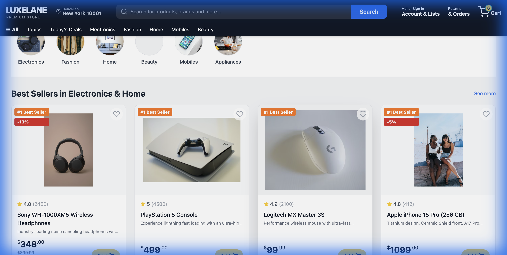
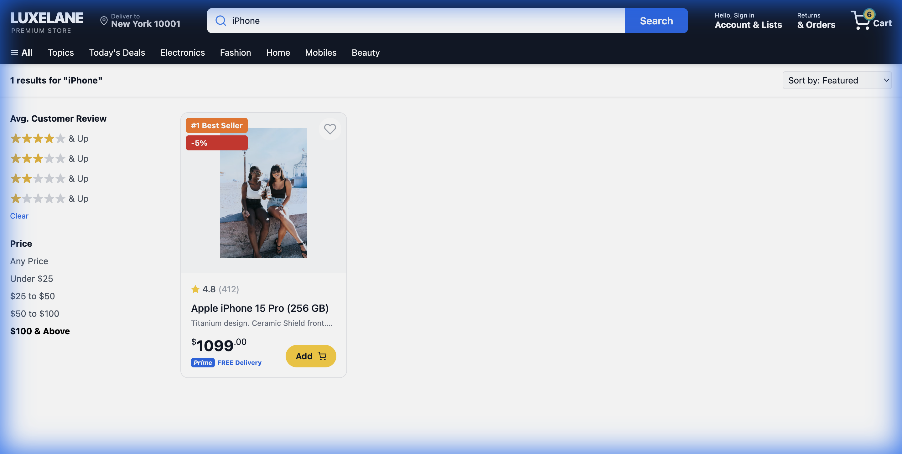

# LuxeLane - Premium E-Commerce Platform

LuxeLane is a sophisticated, full-stack MERN (MongoDB, Express, React, Node.js) e-commerce application designed with a premium aesthetic and modern user experience. It features a robust product catalog, dynamic searching and filtering, a functional shopping cart, secure JWT authentication, and Stripe payment integration.

## 🚀 Live Demo
[luxelanebuy.netlify.app](https://luxelanebuy.netlify.app/)

## ✨ Key Features

### 🛍️ Product Experience
- **Dynamic Catalog**: A rich collection of products across multiple categories (Electronics, Mobiles, Fashion, Home, Beauty, Appliances).
- **Advanced Filtering**: Filter products by price range and minimum customer ratings.
- **Smart Sorting**: Sort results by price (Low to High, High to Low), customer reviews, or featured status.
- **Responsive Search**: Real-time keyword search with instant result updates.
- **Premium UI**: Modern teal-to-purple gradient theme with a sleek, Amazon-inspired layout.

### 🔐 Security & Authentication
- **JWT-Based Auth**: Secure user registration and login using JSON Web Tokens.
- **Password Hashing**: Industry-standard encryption using `bcryptjs`.
- **Protected State**: Global authentication state managed via React Context API, with persistence through `localStorage`.
- **User Dashboard**: Personalized Navbar greeting and account management options.

### 🛒 Cart & Checkout
- **Persistent Cart**: Items stay in your cart even after a page refresh.
- **Real-time Updates**: Instant badge count updates and subtotal calculations.
- **Quantity Management**: Easily adjust quantities or remove items within the cart.
- **Secure Payments**: Integrated with **Stripe API** for handling secure credit card transactions.

## 🛠️ Tech Stack

### Frontend
- **React.js**: Library for building the user interface.
- **Vite**: Ultra-fast frontend build tool.
- **Tailwind CSS**: Utility-first CSS framework for custom, premium styling.
- **Framer Motion**: For smooth micro-animations and transitions.
- **React Router Dom**: For seamless single-page application navigation.
- **React Icons**: Comprehensive icon library (Feather, FontAwesome).
- **Axios**: Promised-based HTTP client for API calls.

### Backend
- **Node.js**: JavaScript runtime environment.
- **Express.js**: Web framework for the API.
- **MongoDB & Mongoose**: NoSQL database and ODM for data modeling.
- **JSON Web Token (JWT)**: For secure transmission of information between parties as a JSON object.
- **Bcryptjs**: For hashing sensitive user data.
- **Stripe SDK**: For processing payments securely.

## 📦 Installation & Setup

### Prerequisites
- Node.js (v16+)
- MongoDB (Local or Atlas)
- Stripe Account (for API keys)

### Step 1: Clone the Repo
```bash
git clone https://github.com/Harsh10773/LuxeLane.git
cd LuxeLane
```

### Step 2: Server Configuration
1. Navigate to the server directory:
   ```bash
   cd server
   npm install
   ```
2. Create a `.env` file in the `server` folder:
   ```env
   PORT=5000
   MONGO_URI=your_mongodb_uri
   JWT_SECRET=your_jwt_secret
   STRIPE_SECRET_KEY=your_stripe_secret_key
   ```
3. Start the server:
   ```bash
   npm run dev
   ```

### Step 3: Client Configuration
1. Navigate to the client directory:
   ```bash
   cd ../client
   npm install
   ```
2. Start the development server:
   ```bash
   npm run dev
   ```

## 📸 Screenshots

### Home Page


### Search & Filtering



